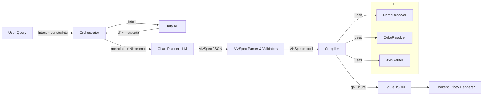
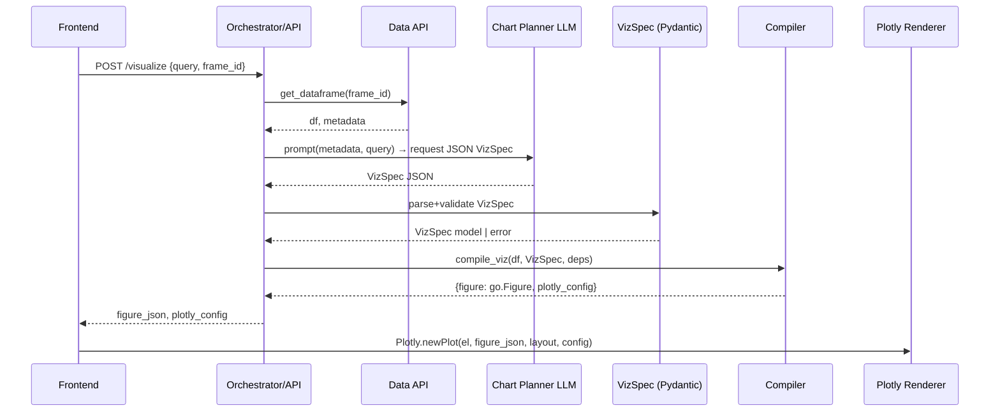
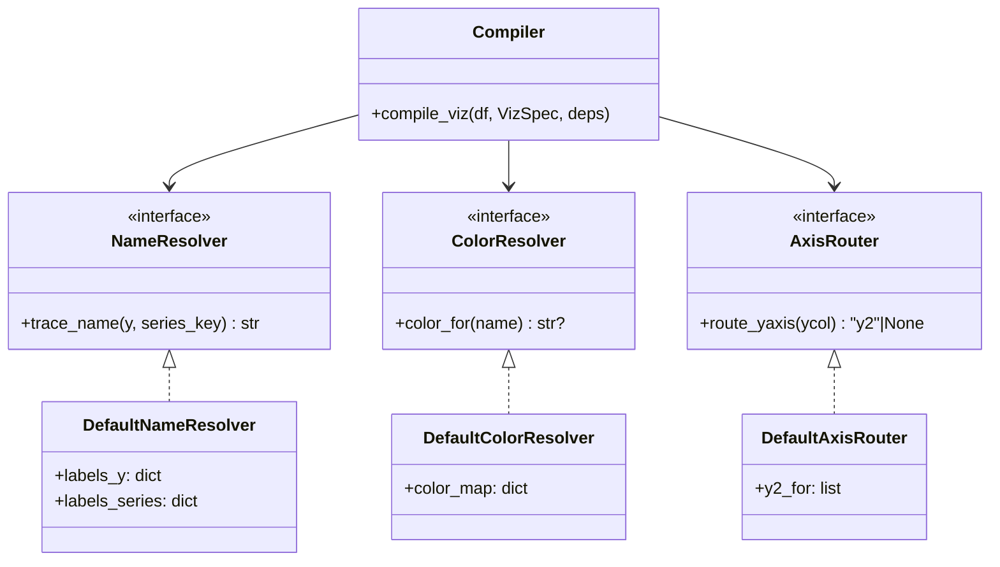

# LLM → Plotly Visualization Pipeline — Architecture & Design

> Goal: From **(dataframe + metadata + user intent)** to **Plotly `go.Figure`** via a strict **Pydantic DSL (VizSpec)** and a modular **compiler** with dependency injection (naming, colors, axis routing).

---

## 1) System overview (big picture)

* **Inputs**: pre-transformed dataframe(s) + dataframe metadata + NL query
* **Planner**: LLM produces **VizSpec** (Pydantic) — strictly validated & semantically checked
* **Compiler**: `compile_viz(df, spec, deps)` → `go.Figure` + Plotly.js config
* **Frontend**: renders `figure.to_plotly_json()` + Plotly.js `config`



---

## 2) Runtime sequence



---

## 3) Component map & responsibilities

| Component              | Responsibility                                                 | Input → Output                                  | Contracts/Interfaces                        |
| ---------------------- | -------------------------------------------------------------- | ----------------------------------------------- | ------------------------------------------- |
| **Data API**           | Provides pre-transformed dfs; metadata for columns/types/shape | request → `pd.DataFrame`, metadata              | Stable schema; no aggregation here          |
| **Chart Planner LLM**  | Chooses chart type/encodings; names; axis routing; color hints | metadata + NL query → VizSpec JSON              | Must adhere to DSL shape; **no prose**      |
| **VizSpec (Pydantic)** | Structural + semantic validation                               | JSON → `VizSpec` model                          | Fails fast with clear error codes           |
| **Compiler**           | Deterministic mapping to Plotly traces/layout                  | (`df`, `VizSpec`, `deps`) → `go.Figure`, config | No data transforms; trace construction only |
| **DI: NameResolver**   | Trace/legend labeling policy                                   | (`y`, `series_key`) → `str`                     | Default uses `labels.y`/`labels.series`     |
| **DI: ColorResolver**  | Stable color assignment                                        | `name` → color                                  | Default uses `colors.color_map`             |
| **DI: AxisRouter**     | y/y2 assignment rules                                          | `ycol` → {None,"y2"}                            | Default uses `axis.y2_for`                  |

**Why DI?** Policies (naming, color, axis routing) vary per org/team/product. DI lets us swap strategies without touching the compiler core.

---

## 4) DSL → Plotly mapping

| DSL Field                    | Meaning                           | Plotly Binding                                       |
| ---------------------------- | --------------------------------- | ---------------------------------------------------- |
| `chart.type`                 | trace family                      | `go.Scatter`/`go.Bar`/`go.Box`/`go.Heatmap`/`go.Pie` |
| `chart.mode`                 | render mode for scatter/line/area | `Scatter(mode=...)`                                  |
| `chart.orientation`          | bar orientation                   | swap x/y when `h`                                    |
| `chart.barmode`              | bar layout behavior               | `layout.barmode`                                     |
| `chart.histnorm`             | hist normalization                | `Histogram(histnorm=...)`                            |
| `data.x`, `data.y`, `data.z` | column bindings                   | trace `x`,`y`,`z`                                    |
| `data.series.by`             | split into traces                 | `for key, g in df.groupby(by)`                       |
| `data.text`                  | labels/hovertext                  | `text=g[text]`/`text=df[text]`                       |
| `data.axis.y2_for`           | dual axis routing                 | trace `.yaxis="y2"` + `layout.yaxis2`                |
| `data.axis.area_stackgroup`  | stacked area                      | `Scatter(fill='tozeroy', stackgroup=...)`            |
| `data.encodings.*`           | common cosmetics                  | `marker.size`, `opacity`, `line.shape`               |
| `data.labels.*`              | friendly names                    | trace `name`, legend labels                          |
| `data.colors.color_map`      | deterministic colors              | `marker.color` / `line.color`                        |
| `layout.*`                   | presentation                      | `fig.update_layout(...)`                             |
| `plotly_config.*`            | FE behavior                       | Plotly.js config (renderer side)                     |

---

## 5) Error handling & contract

**Error classes** (examples):

* `SpecParseError` (invalid JSON)
* `SpecValidationError` (Pydantic field or semantic check fail)
* `CompileError` (unsupported chart/field combos)

**Response pattern**

```json
{
  "ok": false,
  "error": {
    "code": "SpecValidationError",
    "message": "heatmap requires x,y,z; missing: ['z']",
    "path": ["chart","type"]
  }
}
```

**Defensive limits**

* Max traces per figure: e.g., 64
* Max points per trace (soft warn): e.g., 200k
* String length caps for labels/titles

---

## 6) Observability (prod readiness)

* **Logs**: spec version, chart.type, trace\_count, column bindings, DI strategies used
* **Metrics**: `viz_spec_parse_ms`, `viz_compile_ms`, `viz_trace_count`, `viz_render_failures`
* **Sampling**: log full spec only at sample rate; otherwise hash

---

## 7) Versioning & migrations

* `VizSpec.version` (const "1.0") in schema
* Introduce `1.1`, `2.0` as non-breaking/breaking sets; add a tiny **upgrade adapter** layer
* Keep compiler backward-compatible across minor versions (feature gated)

---

## 8) Testing strategy

* **Schema tests**: required/optional fields, enum coercions, color validation
* **Semantic tests**: heatmap requires x,y,z; area must include line mode; y2\_for ⊆ y
* **Compiler golden tests**: compare `figure.to_plotly_json()` against snapshots (stable sorts)
* **Property tests**: random column names/types; ensure no exceptions; round-trip
* **LLM e2e tests**: prompt → JSON → parse → compile → smoke render

---

## 9) Security & safety

* Treat VizSpec as untrusted input — validate before compile
* Title/labels sanitized (length, control chars)
* Prevent excessive memory/CPU (trace & point caps)

---

## 10) Example spec (concise) + expected mapping

```json
{
  "version": "1.0",
  "chart": { "type": "line", "mode": "lines" },
  "data": {
    "x": "date",
    "y": "revenue",
    "series": { "by": "region" },
    "labels": { "series": { "na": "NA", "eu": "EU" } },
    "encodings": { "line_shape": "linear", "marker_size": 6, "opacity": 0.95 }
  },
  "layout": {
    "title": "Revenue by Region",
    "xaxis_title": "Date",
    "yaxis_title": "Revenue",
    "hovermode": "x unified",
    "legend": { "orientation": "h", "y": 1.08, "x": 0 },
    "template": "plotly_white"
  },
  "plotly_config": { "responsive": true, "displaylogo": false }
}
```

**Compiler result (essence)**: `Scatter` traces grouped by `region`; `mode='lines'`; unified hover; legend horizontal; template `plotly_white`.

---

## 11) DI quick guide (how deps plug in)



**Swap examples**

* **Brand palette**: provide `ColorResolver` backed by a palette service
* **Enterprise naming**: provide `NameResolver` that title-cases + abbreviates
* **Analytics-specific dual axes**: `AxisRouter` that uses metadata rules

---

## 12) Integration plan (IDE agent checklist)

1. Add modules: `pydantic_viz_spec.py`, `viz_compile.py`
2. LLM tool/function: enforce **structured JSON** → `VizSpec`
3. Parse: `VizSpec.parse_raw(llm_json)` (v2: `model_validate_json`)
4. Fetch df from Data API, ensure pre-transformed
5. Call `compile_viz(df, spec)` → `{figure, plotly_config}`
6. Serialize: `figure.to_plotly_json()`
7. FE: `Plotly.newPlot(el, data, layout, plotly_config)`
8. Observability: log version, type, trace\_count; record timings

---

## 13) Open questions / decisions to finalize

* Do we cap traces/points at runtime or preflight on metadata?
* Default hovertemplate per chart type?
* Global `colorway` vs per-trace `color_map` precedence?
* Numeric formatting & time axis locale (FE vs BE responsibility)
* Error surface shape for LLM corrections (automatic re-prompt?)

---

### TL;DR

* **Stable DSL** (`VizSpec`) + **deterministic compiler** + **DI seams** = production-ready path from intent to interactive charts with Plotly, without entangling business policy in rendering logic.


--------------


clank received. locking in a production-lean Pydantic schema + a modular, DI-friendly compiler that consumes it and returns a `go.Figure` + Plotly.js config. I’m targeting Pydantic v1 syntax for broad compatibility (works in v2 via `from pydantic.v1 import ...`). I’ll call out the tiny diffs for v2 at the end.

# Pydantic models (the DSL schema)

```python
# pydantic_viz_spec.py
from __future__ import annotations
from enum import Enum
from typing import Dict, List, Optional, Union, Any
import re

from pydantic import BaseModel, Field, validator, root_validator

# ---------- Enums ----------

class ChartType(str, Enum):
    line = "line"
    scatter = "scatter"
    bar = "bar"
    histogram = "histogram"
    box = "box"
    heatmap = "heatmap"
    pie = "pie"
    area = "area"

class Mode(str, Enum):
    lines = "lines"
    markers = "markers"
    lines_markers = "lines+markers"

class Orientation(str, Enum):
    v = "v"
    h = "h"

class BarMode(str, Enum):
    group = "group"
    stack = "stack"
    relative = "relative"

class HistNorm(str, Enum):
    none = "none"
    percent = "percent"
    probability = "probability"
    density = "density"

class HoverMode(str, Enum):
    x = "x"
    y = "y"
    closest = "closest"
    x_unified = "x unified"
    y_unified = "y unified"

class LineShape(str, Enum):
    linear = "linear"
    spline = "spline"

# ---------- Small validators ----------

_HEX = re.compile(r"^#(?:[0-9a-fA-F]{6}|[0-9a-fA-F]{8})$")

def _valid_color(s: str) -> bool:
    # allow hex (#RRGGBB[AA]) or anything else (named/CSS) to keep flexibility
    return bool(_HEX.match(s)) or isinstance(s, str)

# ---------- Nested leaf models ----------

class EncodingsSpec(BaseModel):
    marker_size: Optional[int] = Field(6, ge=1, le=64)
    opacity: Optional[float] = Field(0.9, ge=0.0, le=1.0)
    line_shape: Optional[LineShape] = None

class SeriesSpec(BaseModel):
    by: Optional[str] = None

class AxisSpec(BaseModel):
    y2_for: Optional[List[str]] = None                 # route these y columns to y2
    area_stackgroup: Optional[str] = None              # only meaningful for area

class LabelsSpec(BaseModel):
    y: Optional[Dict[str, str]] = None                 # per-y column friendly labels
    series: Optional[Dict[str, str]] = None            # per-series/category friendly labels

class ColorsSpec(BaseModel):
    color_map: Optional[Dict[str, str]] = None

    @validator("color_map")
    def _validate_colors(cls, v):
        if not v: 
            return v
        for k, c in v.items():
            if not _valid_color(c):
                raise ValueError(f"Invalid color for key '{k}': {c}")
        return v

# ---------- Core sections ----------

class ChartSpec(BaseModel):
    type: ChartType
    mode: Optional[Mode] = None                        # used by line/scatter/area
    orientation: Optional[Orientation] = None          # used by bar
    barmode: Optional[BarMode] = None                  # bar layout behavior
    histnorm: Optional[HistNorm] = None                # histogram

    @root_validator
    def _defaults_and_semantics(cls, values):
        t: ChartType = values.get("type")
        mode: Optional[Mode] = values.get("mode")
        if t in {ChartType.line, ChartType.area} and mode is None:
            values["mode"] = Mode.lines
        if t != ChartType.bar:
            values["orientation"] = values.get("orientation") if t == ChartType.bar else values.get("orientation")
        if t != ChartType.histogram:
            values["histnorm"] = None
        return values

class DataSpec(BaseModel):
    frame_name: Optional[str] = None
    x: Optional[str] = None
    y: Optional[Union[str, List[str]]] = None
    z: Optional[str] = None
    text: Optional[str] = None
    name: Optional[str] = None

    series: Optional[SeriesSpec] = None
    axis: Optional[AxisSpec] = None
    encodings: Optional[EncodingsSpec] = None
    labels: Optional[LabelsSpec] = None
    colors: Optional[ColorsSpec] = None

    @validator("y")
    def _unique_y_list(cls, v):
        if isinstance(v, list):
            if not v:
                raise ValueError("y list cannot be empty")
            if len(set(v)) != len(v):
                raise ValueError("y list contains duplicates")
        return v

class LayoutSpec(BaseModel):
    title: Optional[str] = None
    xaxis_title: Optional[str] = None
    yaxis_title: Optional[str] = None
    yaxis2_title: Optional[str] = None
    hovermode: Optional[HoverMode] = None
    template: Optional[str] = None                     # let Plotly validate at runtime
    colorway: Optional[List[str]] = None
    legend: Optional[Dict[str, Any]] = None            # open dict to allow any Plotly legend args
    height: Optional[int] = Field(450, ge=200, le=2000)
    width: Optional[int] = Field(None, ge=200, le=4000)

    @validator("colorway")
    def _validate_colorway(cls, v):
        if v:
            for c in v:
                if not _valid_color(c):
                    raise ValueError(f"Invalid color in colorway: {c}")
        return v

class PlotlyJSConfig(BaseModel):
    responsive: bool = True
    displayModeBar: bool = True
    displaylogo: bool = False
    scrollZoom: bool = False
    modeBarButtonsToRemove: Optional[List[str]] = None

    class Config:
        allow_population_by_field_name = True
        allow_population_by_alias = True
        extra = "ignore"

class VizSpec(BaseModel):
    version: str = Field("1.0", const=True)
    chart: ChartSpec
    data: DataSpec
    layout: Optional[LayoutSpec] = None
    plotly_config: Optional[PlotlyJSConfig] = Field(None, alias="plotly_config")

    class Config:
        allow_population_by_field_name = True
        allow_population_by_alias = True
        extra = "forbid"

    # Semantic checks that help LLM outputs be sane
    @root_validator
    def _semantic_checks(cls, values):
        chart: ChartSpec = values.get("chart")
        data: DataSpec = values.get("data")
        layout: LayoutSpec = values.get("layout")

        # Heatmap strongly prefers x,y,z all present
        if chart and chart.type == ChartType.heatmap:
            missing = [k for k in ("x", "y", "z") if getattr(data, k) is None]
            if missing:
                raise ValueError(f"heatmap requires x, y, z; missing: {missing}")

        # y2_for must reference y columns if y is a list
        if data and data.axis and data.axis.y2_for and isinstance(data.y, list):
            bad = set(data.axis.y2_for) - set(data.y)
            if bad:
                raise ValueError(f"y2_for contains columns not in y: {sorted(bad)}")

        # Area charts: encourage a mode compatible with fill
        if chart and chart.type == ChartType.area and chart.mode == Mode.markers:
            raise ValueError("area charts require a line-bearing mode (lines or lines+markers)")

        # If layout.hovermode set, bound it to known values (enum covers this)
        return values
```

* This schema is tight enough for **structured LLM output** and strict enough to catch common mistakes before compile time.
* You can get a JSON Schema for toolformer/response\_format with `VizSpec.schema_json(indent=2)`.

---

# Compiler with dependency injection (clean seams)

Below is a DI-friendly compiler: you pass a `VizSpec`, a `DataFrame`, and optional “deps” that let you override naming and color resolution or trace strategies without touching core logic.

```python
# viz_compile.py
from __future__ import annotations
from dataclasses import dataclass
from typing import Protocol, Optional, Dict, Any, List, Iterable
import pandas as pd
import plotly.graph_objects as go

from pydantic_viz_spec import VizSpec, ChartType, Mode

# ---------- DI Protocols ----------

class NameResolver(Protocol):
    def trace_name(self, base_y: Optional[str], series_key: Optional[str]) -> str: ...

class ColorResolver(Protocol):
    def color_for(self, name: str) -> Optional[str]: ...

class AxisRouter(Protocol):
    def route_yaxis(self, ycol: Optional[str]) -> Optional[str]:  # returns "y", "y2", or None
        ...

# ---------- Defaults ----------

@dataclass
class DefaultNameResolver:
    labels_y: Dict[str, str]
    labels_series: Dict[str, str]

    def trace_name(self, base_y: Optional[str], series_key: Optional[str]) -> str:
        if series_key is not None:
            return str(self.labels_series.get(str(series_key), series_key))
        if base_y is None:
            return ""
        return str(self.labels_y.get(str(base_y), base_y))

@dataclass
class DefaultColorResolver:
    color_map: Dict[str, str]

    def color_for(self, name: str) -> Optional[str]:
        return self.color_map.get(name)

@dataclass
class DefaultAxisRouter:
    y2_for: Optional[List[str]]

    def route_yaxis(self, ycol: Optional[str]) -> Optional[str]:
        if self.y2_for and ycol in set(self.y2_for):
            return "y2"
        return None

@dataclass
class CompilerDeps:
    names: NameResolver
    colors: ColorResolver
    axis: AxisRouter

def _deps_from_spec(spec: VizSpec) -> CompilerDeps:
    labels_y = (spec.data.labels.y if spec.data.labels and spec.data.labels.y else {})
    labels_series = (spec.data.labels.series if spec.data.labels and spec.data.labels.series else {})
    color_map = (spec.data.colors.color_map if spec.data.colors and spec.data.colors.color_map else {})
    y2_for = (spec.data.axis.y2_for if spec.data.axis and spec.data.axis.y2_for else None)
    return CompilerDeps(
        names=DefaultNameResolver(labels_y=labels_y, labels_series=labels_series),
        colors=DefaultColorResolver(color_map=color_map),
        axis=DefaultAxisRouter(y2_for=y2_for),
    )

# ---------- Utilities ----------

def _apply_common(trace: go.BaseTraceType, name_key: str, spec: VizSpec, deps: CompilerDeps) -> None:
    enc = spec.data.encodings
    color = deps.colors.color_for(name_key) if name_key else None
    if enc:
        if enc.opacity is not None:
            trace.update(opacity=enc.opacity)
        if enc.marker_size is not None:
            trace.update(marker={"size": enc.marker_size, **(trace.marker.to_plotly_json() if hasattr(trace, "marker") else {})})
        if enc.line_shape is not None and hasattr(trace, "line"):
            trace.update(line={"shape": enc.line_shape.value, **(trace.line.to_plotly_json() if hasattr(trace, "line") else {})})
    if color:
        # Try to apply to both marker and line depending on trace type
        if hasattr(trace, "marker"):
            trace.update(marker={"color": color, **(trace.marker.to_plotly_json() if hasattr(trace, "marker") else {})})
        if hasattr(trace, "line"):
            trace.update(line={"color": color, **(trace.line.to_plotly_json() if hasattr(trace, "line") else {})})

def _route_axis(trace: go.BaseTraceType, ycol: Optional[str], deps: CompilerDeps) -> None:
    axis = deps.axis.route_yaxis(ycol)
    if axis == "y2":
        trace.update(yaxis="y2")

# ---------- Main compile ----------

def compile_viz(df: pd.DataFrame, spec: VizSpec, deps: Optional[CompilerDeps] = None) -> Dict[str, Any]:
    """
    Returns {"figure": go.Figure, "plotly_config": dict}
    Assumes df is fully pre-transformed (no filtering/aggregation here).
    """
    deps = deps or _deps_from_spec(spec)
    fig = go.Figure()

    chart = spec.chart
    data = spec.data
    layout = spec.layout

    x = data.x
    y = data.y
    z = data.z
    series_by = data.series.by if data.series else None

    # ---- trace creation ----
    if chart.type in (ChartType.line, ChartType.scatter, ChartType.area):
        base_cls = go.Scatter
        mode = (chart.mode.value if chart.mode else (Mode.lines.value if chart.type in (ChartType.line, ChartType.area) else Mode.markers.value))
        area_opts = {}
        if chart.type == ChartType.area:
            area_opts.update(fill="tozeroy")
            if data.axis and data.axis.area_stackgroup:
                area_opts.update(stackgroup=data.axis.area_stackgroup)

        if isinstance(y, list) and not series_by:
            for yc in y:
                tr = base_cls(x=df[x] if x else None, y=df[yc], mode=mode,
                              name=deps.names.trace_name(yc, None), **area_opts)
                _apply_common(tr, yc, spec, deps); _route_axis(tr, yc, deps); fig.add_trace(tr)
        elif series_by:
            ycol = y if isinstance(y, str) or y is None else y[0]
            for key, g in df.groupby(series_by):
                tr = base_cls(x=g[x] if x else None, y=g[ycol] if ycol else None, mode=mode,
                              name=deps.names.trace_name(ycol, key), **area_opts)
                _apply_common(tr, str(key), spec, deps); _route_axis(tr, ycol, deps); fig.add_trace(tr)
        else:
            ycol = y if isinstance(y, str) or y is None else y[0]
            tr = base_cls(x=df[x] if x else None, y=df[ycol] if ycol else None, mode=mode,
                          name=deps.names.trace_name(ycol, None), **area_opts)
            _apply_common(tr, ycol, spec, deps); _route_axis(tr, ycol, deps); fig.add_trace(tr)

    elif chart.type == ChartType.bar:
        orient = (chart.orientation.value if chart.orientation else Orientation.v.value)
        X, Y = (data.x, data.y) if orient == "v" else (data.y, data.x)
        if isinstance(y, list) and not series_by:
            for yc in y:
                tr = go.Bar(**({"x": df[X], "y": df[yc]} if orient=="v" else {"x": df[yc], "y": df[X]}),
                            name=deps.names.trace_name(yc, None))
                _apply_common(tr, yc, spec, deps); _route_axis(tr, yc, deps); fig.add_trace(tr)
        elif series_by:
            ycol = y if isinstance(y, str) else y[0]
            for key, g in df.groupby(series_by):
                tr = go.Bar(**({"x": g[X], "y": g[ycol]} if orient=="v" else {"x": g[ycol], "y": g[X]}),
                            name=deps.names.trace_name(ycol, key))
                _apply_common(tr, str(key), spec, deps); _route_axis(tr, ycol, deps); fig.add_trace(tr)
        else:
            ycol = y if isinstance(y, str) else y[0]
            tr = go.Bar(**({"x": df[X], "y": df[ycol]} if orient=="v" else {"x": df[ycol], "y": df[X]}),
                        name=deps.names.trace_name(ycol, None))
            _apply_common(tr, ycol, spec, deps); _route_axis(tr, ycol, deps); fig.add_trace(tr)

    elif chart.type == ChartType.histogram:
        col = data.x or (data.y if isinstance(data.y, str) else (data.y[0] if isinstance(data.y, list) else None))
        tr = go.Histogram(x=df[col], histnorm=(chart.histnorm.value if chart.histnorm else None))
        fig.add_trace(tr)

    elif chart.type == ChartType.box:
        if data.x and data.y and isinstance(data.y, str):
            fig.add_trace(go.Box(x=df[data.x], y=df[data.y], boxpoints="outliers",
                                 name=deps.names.trace_name(data.y, None)))
        else:
            ycol = data.y if isinstance(data.y, str) else (data.y[0] if isinstance(data.y, list) else None)
            fig.add_trace(go.Box(y=df[ycol], boxpoints="outliers", name=deps.names.trace_name(ycol, None)))

    elif chart.type == ChartType.heatmap:
        # x,y,z validated at schema level
        fig.add_trace(go.Heatmap(z=df[z], x=df[x], y=df[y]))

    elif chart.type == ChartType.pie:
        val_col = data.y if isinstance(data.y, str) else (data.y[0] if isinstance(data.y, list) else None)
        fig.add_trace(go.Pie(labels=df[data.x], values=df[val_col]))

    else:
        raise ValueError(f"Unsupported chart type: {chart.type}")

    # ---- layout + layout-derived bits ----
    if layout:
        fig.update_layout(
            title=layout.title,
            xaxis_title=layout.xaxis_title,
            yaxis_title=layout.yaxis_title,
            hovermode=(layout.hovermode.value if layout.hovermode else None),
            template=layout.template,
            colorway=layout.colorway,
            legend=layout.legend,
            height=layout.height,
            width=layout.width,
        )
        # y2 axis if any trace routed
        if spec.data.axis and spec.data.axis.y2_for:
            fig.update_layout(yaxis2=dict(title=layout.yaxis2_title, overlaying="y", side="right"))

    # barmode belongs to layout (but we keep it in chart in the DSL)
    if chart.type == ChartType.bar and chart.barmode:
        fig.update_layout(barmode=chart.barmode.value)

    # Assemble FE config (pass as Plotly.newPlot 3rd arg in JS)
    plotly_cfg = (spec.plotly_config.dict(by_alias=True) if spec.plotly_config else {})

    return {"figure": fig, "plotly_config": plotly_cfg}
```

---

## How this fits your LLM + runtime

* **Structured generation:** ask the LLM to output `VizSpec` strictly (no prose). Parse with `VizSpec.parse_raw(...)`. If you’re on Pydantic v2, use `VizSpec.model_validate_json(...)`.
* **Runtime:** pass `df` and the parsed `VizSpec` to `compile_viz(df, spec)`; serialize `figure.to_plotly_json()` and hand to FE together with `plotly_config`.

---

## Extension seams you can inject later (no rewrite needed)

* **Per-org color policy:** implement `ColorResolver` (e.g., from a brand palette service) and pass as `deps`.
* **Naming policy:** implement `NameResolver` to enforce labeling rules (title case, abbreviations).
* **Chart-type strategies:** if you ever add new `ChartType`s, add a strategy wrapper around the trace creation block (the DI Protocols already isolate the change).

---

## Pydantic v2 note (tiny diffs)

* Imports: `from pydantic import BaseModel, Field, field_validator, model_validator`
* Replace `@validator("field")` → `@field_validator("field")`
* Replace `@root_validator` → `@model_validator(mode="after")` and access `self` fields.
* Parsing: `VizSpec.model_validate(obj)` and `VizSpec.model_validate_json(str)`
  JSON schema: `VizSpec.model_json_schema()`.

---

If you drop me a tiny example (metadata/cols + a JSON spec instance), I’ll run it through this compiler and sanity-check the emitted `Figure` structure for you.
